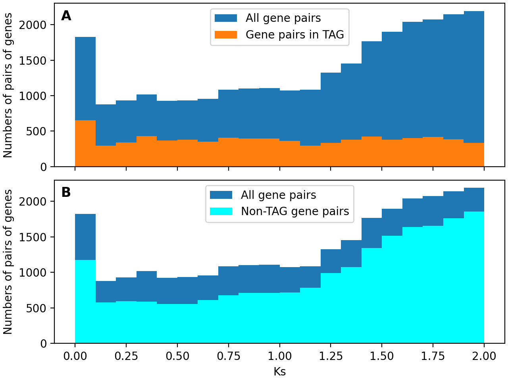

# Analysis of duplicated genes in *Oryza sativa japonica*

This repository contains the code used for the Comparative Genomics cours project on the analysis of duplicated genes in the rice subspecies *Oryza sativa japonica*.

The analysis pipeline is described in the file pipeline.txt. Some input (data/) and output files are missing because of GitHub size limits. The input files used are mentioned in the report.



## Pipeline

A Conda environment YML file (environment.yml) is provided for reproducing the analyses.

```
bash src/01-gene_lengths.sh
bash src/02-genomic_accessions.sh
bash src/03-fix_prot_gene_idlist.sh
bash src/04-blast_result_table.py
bash src/05-blast_result_filtering.sh

# Manual MCL run on Galaxy

python3 src/positions.py
python3 src/create_master_gene_table.py

# TAG stuff
python3 src/tag_finder.py output/master_gene_table.tsv -s 0 -f hsfamily > output/hstags0.tsv
python3 src/tag_finder.py output/master_gene_table.tsv -s 0 -f lsfamily > output/lstags0.tsv
python3 src/tag_finder.py output/master_gene_table.tsv -s 1 -f hsfamily > output/hstags1.tsv
python3 src/tag_finder.py output/master_gene_table.tsv -s 1 -f lsfamily > output/lstags1.tsv
python3 src/tag_finder.py output/master_gene_table.tsv -s 2 -f hsfamily > output/hstags2.tsv
python3 src/tag_finder.py output/master_gene_table.tsv -s 2 -f lsfamily > output/lstags2.tsv

python3 src/tag_histograms.py

# Ka/Ks stuff
chmod u+x src/pal2nal.pl
python3 src/combinations.py
julia -t 7 src/paml_driver.jl
python3 src/ks_histogram.py
```